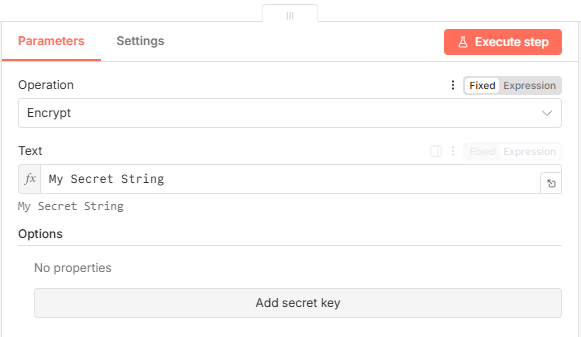

# n8n-nodes-text-encrypt

This is an n8n community node. It lets you encrypt and decrypt text using node crypto module with AES-256-CBC algorithm.

## Installation

Follow the [installation guide](https://docs.n8n.io/integrations/community-nodes/installation/) in the n8n community nodes documentation.

## Usage

1. Add `Text Encryptor` node to your workflow.

    
    
2. Select the operation: `encrypt` or `decrypt`.

    

3. Provide the text to be processed.
4. Provide the secret key _(optional, leave empty to use the default key)_.
5. For decryption, provide the same secret key used for encryption.
6. Connect the node to other nodes as needed in your workflow.
